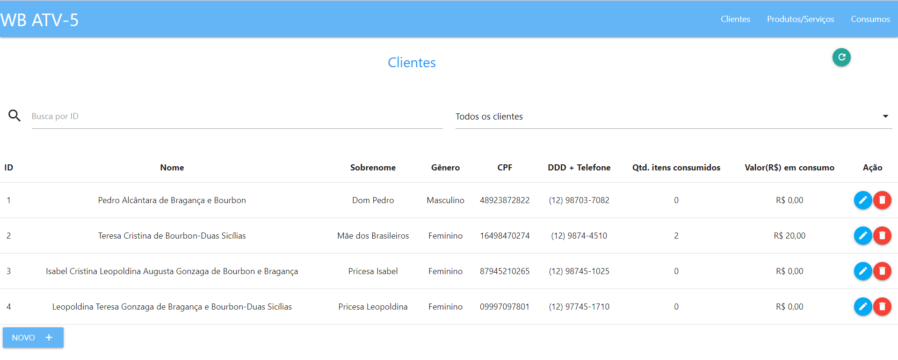

# ATVV-WB
## Atividade 5 (WB) - Programação Orientada a Objetos - Fatec SJC

-------------------------------------
## Descrição da atividade

Cada  uma  das  etapas  que  você  trilhou,  as  atividades  I,  II,  III  e  IV,  foi  uma  preparação. Agora  chegou  o momento  aguardado  por  todos,  o  desenvolvimento  de  um  projeto  com  front-end  e  back-end  completos. O objetivo final da empresa para enfim ter um produto moderno e pronto para enfrentar qualquer concorrência futura. A  última  tarefa,  a  atviv,foi  a  integraçãoentre  front-end  e  back-end,  mas  agora  cabe  a  você  arquitetar  e implementar todo o sistema como uma aplicação web. Depois  de  um  grande debate,  junto  ao time  de  desenvolvimento,  chegou-se à conclusão de quea  biblioteca react deve ser mantida, porque ela é um ótimo framework para desenvolvimento em SPA e será abordagem utilizada no desenvolvimento da aplicação. Utilize todos os seus conhecimentos de desenvolvimento back-end e busque mais sempre que julgar necessário.O objetivo final é criar uma aplicação web, na abordagem SPA, que atenda a todos os requisitos que o sistema precisa  ter,  para  atender  aos  clientes  da  WB. Os  requisitos  foram  descritos  naatvi,  a  primeira  atividade  que deu origem a empresa de desenvolvimento de software. Busque os requisitos na documentação da atvi. Lembre-se, agora a responsabilidade está com você. O futuro da empresa depende das tuas habilidades. Boa sorte na atividade final.

### Front-end

* Inicialmente, é necessário rodar o comando "npm install" para instalar as dependências do projeto front-end.

* Depois, basta rodar o comando "npm run start" no console do terminal do Visual Studio Code e então, a aplicação GUI desenvolida em REACT, MATERIALIZE e MATERIAL UI, carregará automaticamente no endereço http://localhost:3000/

### Back-end

* No repositório https://github.com/viniferlima/ATVV-WB-BACK há  um aplicativo  executável,  que  disponibiliza  todo  o  back-end montado,  com  suas rotas e,  inclusive,  um  banco de  dados  pronto,  que  funciona  em  memória. O  nome do aplicativo executável é “wbbackend-0.0.1-SNAPSHOT”.Este arquivo está disponível na pasta chamada de “executável”. O executável é capaz de “levantar” toda a aplicação back-end,  de  uma  vez  só,  mas  para  isso  é  necessário utilizar a máquina virtual Java, para execução. Isto é feito através do comando: “java -jar wbbackend-0.0.1-SNAPSHOT.jar”. Este comando  deve  ser  executado  em  um  terminal. Algo  importante  é  que  o  executável  só  funciona  com  uma máquina virtual na versão 17 ou superior.

## Requisitos

* CRUD de clientes
* CRUD de Produtos/Serviços
* Listagem de consumos
* Criação de um novo consumo
* Listagem dos 10 clientes que mais consumiram produtos ou serviços, em quantidade, não em valor
* Listagem de todos os clientes por gênero
* Listagem geral dos serviços ou produtos mais consumidos
* Listagem dos serviços ou produtos mais consumidos por gênero
* Listagem dos 10 clientes que menos consumiram produtos ou serviços
* Listagem dos 5 clientes que mais consumiram em valor, não em quantidade
* Listagem dos consumos por maior valor total
* Listagem dos consumos por menor valor total
* Layout mobile

### Telas de busca/listagem

* Neste tipo de tela são listados os dados registrados nas entidades do banco de dados;
* Também é possível realizar a busca por um registro específico. Basta inserir o ID do registro no campo de entrada de texto com placeholder "Busca por ID". Se ele for encontrado, a tabela será atualizada e passará a exibir apenas os dados encontrados a partir do ID buscado no campo de texto; se não for encontrado, um toasty popup será acionado na interface do usuário.
* Outra função disponível nesta tela é a exclusão de um registro. Ao clicar no botão que possui um ícone de lixeira vermelha, a remoção do item na base de dados é efetuada.
* Por meio do combobox é possível fazer uma listagem específica dos itens.
* O botão verde de refresh recarrega/atualiza os dados na tabela. 

### Telas de cadastro

* Nesta tipo de tela é possível criar um novo registro no banco de dados:

### Telas de alteração de dados

* Neste tipo de tela é possível atualizar os dados de um registro já existente no banco de dados:

### Telas de criação de compra/consumo

* Nesta tela é possível adicionar os itens ao carrinho de compras, selecionar o cliente atrelado a esta compra, remover itens do carrinho, visualizar o totalizador da compra (R$), e também salvar os dados no botão "submit".

### Tela de visualização de compra/consumo

* Nesta tela é possível apenas visualizar os dados completos da compra. 
* Diferentemente das outras entidades, não é possível realizar alteração dos dados de um consumo (não faz parte dos requisitos).

### Layout Mobile

### Observações

* O projeto do back-end se econtra no repositório https://github.com/viniferlima/ATVV-WB-BACK. Não redigi um arquivo ReadMe no outro repositório, todas as informações relevantes a ATVV-WB estarão contidas neste repositório.

